# KN02 screenshots + description

## A) Teil 1:

### HTML-Seite, inkl. URL:
<picture>
  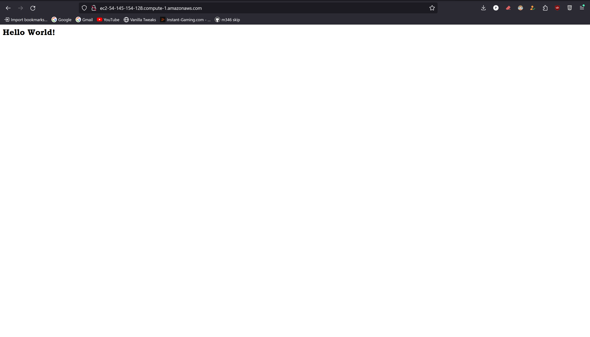
</picture>

### Liste der EC2-Instanzen:
<picture>
  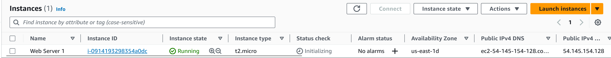
</picture>

### Details der Web Server-Instanz (öffentliche IP sichtbar):
<picture>
  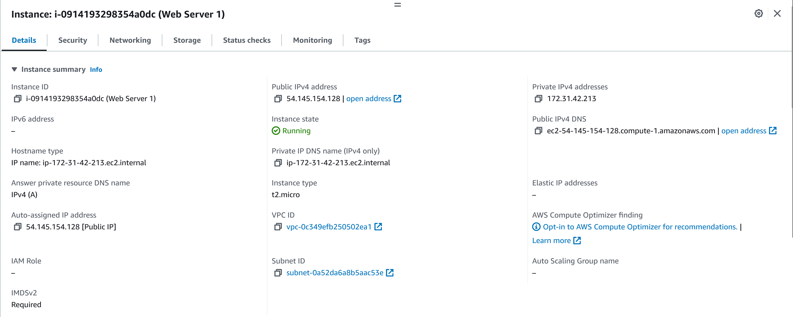
</picture>

### Liste der Inbound-Regeln:
<picture>
  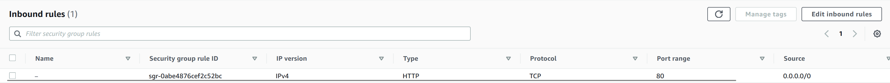
</picture>

## A) Teil 2:

### Liste der Buckets:
<picture>
  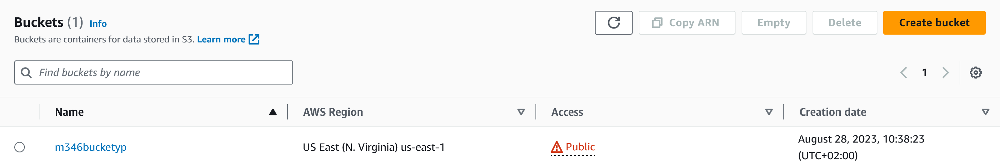
</picture>

### HTML-Seite, inkl. URL:
<picture>
  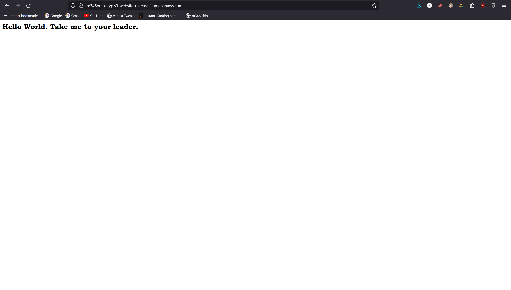
</picture>

### Liste der Dateien im Bucket:
<picture>
  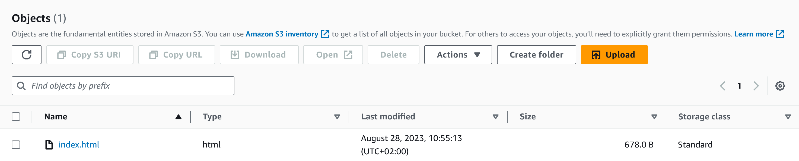
</picture>

### Eigenschaften von "Static website hosting":
<picture>
  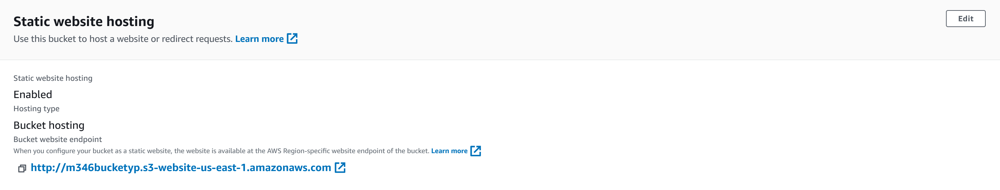
</picture>

## B)

### Screenshot mit dem ssh-Befehl und des Resultats unter Verwendung des ersten Schlüssels:
<picture>
  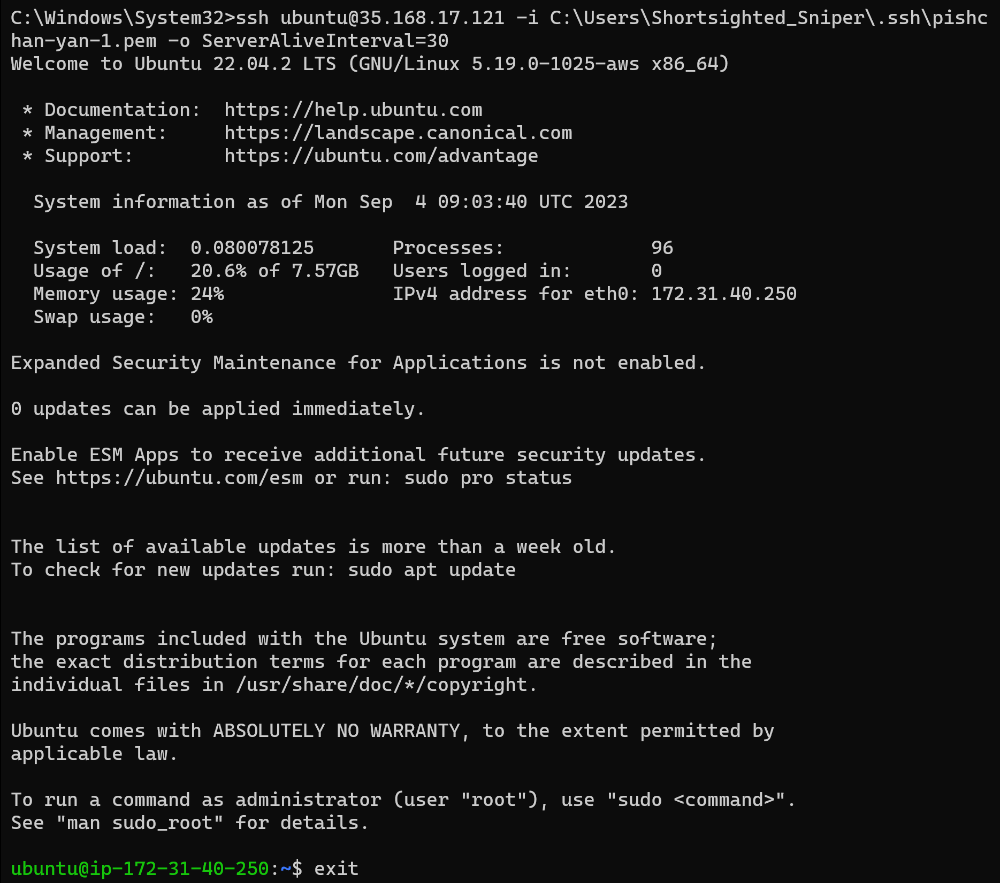
</picture>

### Screenshot mit dem ssh-Befehl und des Resultats unter Verwendung des zweiten Schlüssels:
<picture>
  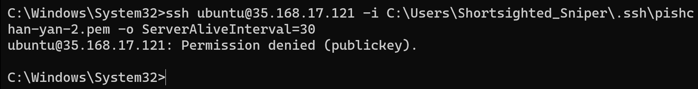
</picture>

### Screenshot der Instanz-Detail (oder Liste), so dass der verwendete Schlüssel sichtbar ist:
<picture>
  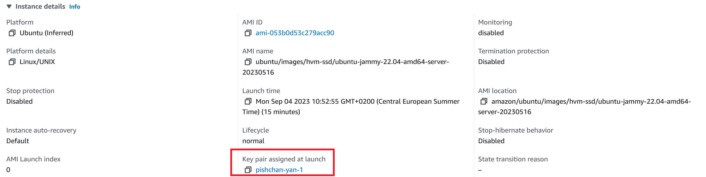
</picture>

## C)

### Apache-Site Screenshot:
<picture>
  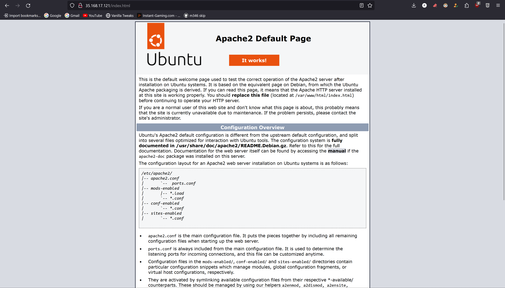
</picture>

### PHP-Site Screenshot:
<picture>
  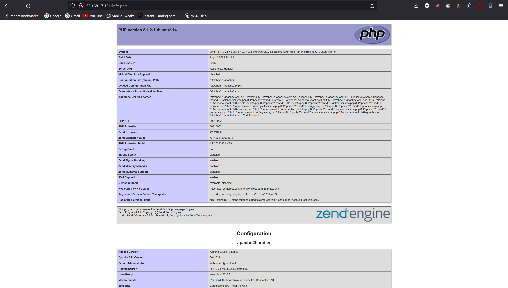
</picture>

### DB-Users-Site:
<picture>
  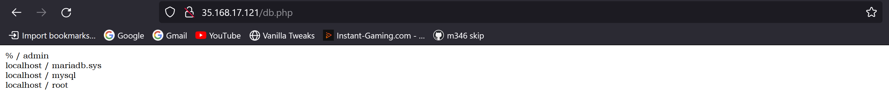
</picture>
