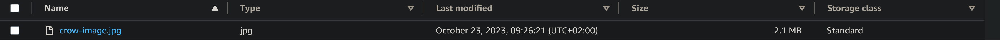
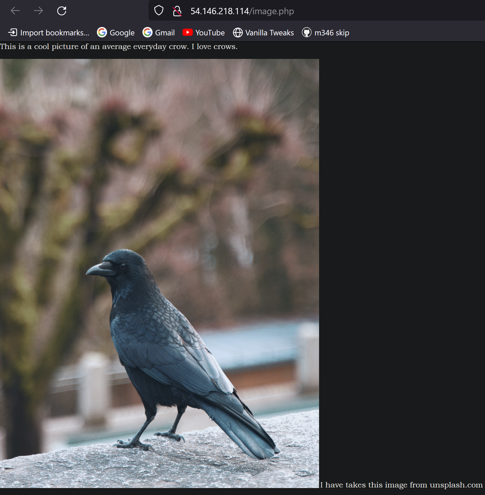
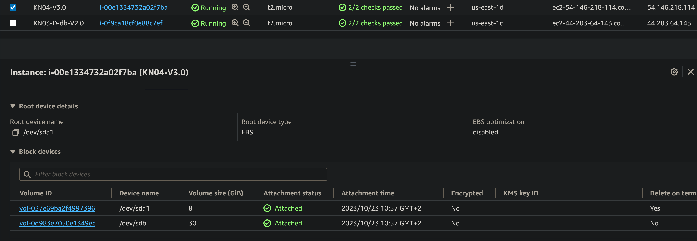

# KN04 screenshots + description

## A) Create picture and host on S3

### Screenshot of the bucket:
<picture>
  
</picture>

### Screenshot of the pictur online:
<picture>
  
</picture>

## B) Adding Web-Server with PHP-site:

### New Cloud-init of the Web-instance:

```
#cloud-config
users: 
  - name: ubuntu 
    sudo: ALL=(ALL) NOPASSWD:ALL 
    groups: users, admin 
    home: /home/ubuntu 
    shell: /bin/bash 
    ssh_authorized_keys: 
      - ssh-rsa AAAAB3NzaC1yc2EAAAADAQABAAABAQCCr5+BBKVeaBmBW3XdvW3uikOxkyWvLlmY/W9QwK7Pa/ALlBRw4W2rfyOa+BxuKSZsVwLKaQKfc0dpKve22HPquuSAC7vfARSopZCXyTcusyNw/HoUuSnZD9gRl7zaVOOZ+WpM0dlUP4upawPMHgeNRyXFRDTzi+Z5B/XAc8YXGxyEKxQvz6dEJ+vBa6pLz5ZR+tH4hbymHpzr5y3n6S9zsOcj0O7+YbJeanUNRZd6xENTWc9v9/dOA+NKHTgyUcIYH1Dc03WfswMkrwqEZLjWbKBbKntrAbwqLhmjlPEYboiuXLvFWIGIvNOcXQGSrhHsr/n2QmP7A01hRZifnABv aws-key       
      - ssh-rsa AAAAB3NzaC1yc2EAAAADAQABAAABAQC0WGP1EZykEtv5YGC9nMiPFW3U3DmZNzKFO5nEu6uozEHh4jLZzPNHSrfFTuQ2GnRDSt+XbOtTLdcj26+iPNiFoFha42aCIzYjt6V8Z+SQ9pzF4jPPzxwXfDdkEWylgoNnZ+4MG1lNFqa8aO7F62tX0Yj5khjC0Bs7Mb2cHLx1XZaxJV6qSaulDuBbLYe8QUZXkMc7wmob3PM0kflfolR3LE7LResIHWa4j4FL6r5cQmFlDU2BDPpKMFMGUfRSFiUtaWBNXFOWHQBC2+uKmuMPYP4vJC9sBgqMvPN/X2KyemqdMvdKXnCfrzadHuSSJYEzD64Cve5Zl9yVvY4AqyBD aws-key
ssh_pwauth: false 
disable_root: false 
package_update: true 
packages:
  - curl 
  - wget 
  - apache2
  - php
  - libapache2-mod-php
write_files:
    - path: /var/www/html/image.php
      content: |
        <?php
          $ihrname = 'pishchan"

          <html>
            <head>
              <title>echo($ihrname)</title>
            </head>
          <body>
            This is a cool picture of an average everyday crow. I love crows.
            <br/>
            
            I have takes this image from unsplash.com
          </body>
        </html>
        ?>
runcmd:
  - sudo a2enconf adminer
  - sudo systemctl restart mariadb.service
  - sudo systemctl restart apache2
```

### Screenshot of image.php:
<picture>
  
</picture>

## C) Adding EBS:

### Screenshot of the EBS of the instance:
<picture>
  
</picture>

## D) Speichereigenschaften erkennen

|                          | Typ  | Persitenz |
|           ---            | ---  |    ---    |
| EBS Root                 | hot  |    nein   |
| EBS Zusätzliches Volumen | warm |     ja    |
| S3                       | cold |     ja    |

### Begründung:

#### 1. Hot Storage:

Hot storage is data that is accessed frequently. This could be data that is being actively used by employees or customers. It needs to be stored on fast storage so that it can be accessed quickly. Is useally has little 

#### 2. Warm Storage:

Warm storage is data that is accessed less frequently. This could be data that is used for reporting or analytics. It doesn’t need to be accessed as quickly as hot data, so it can be stored on slightly slower, capacity-optimized storage.

#### 3. Cold Storage:

Cold storage is data that is rarely accessed. This could be data that is archived for compliance reasons. It can be stored on even slower, “cheap and deep” storage.
