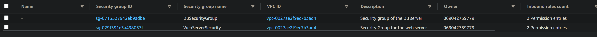

# KN05 - Doku

## A)

### Diagram:
<picture>
  
</picture>

## B)

### Subnet:
<picture>
  
</picture>

### Definierte IPs:

Web ip: 18.206.8.172 

DB ip: 34.193.191.25

# C)

### List of security groups:
<picture>
  
</picture>

### Inbound Rules:
<picture>
  
</picture>

### Elastic IPs:
<picture>
  
</picture>

### index.html
<picture>
  
</picture>

### info.php
<picture>
  
</picture>

### db.php:
<picture>
  
</picture>

### Instance List:
<picture>
  
</picture>

### Subnet ID of the DB:
<picture>
  
</picture>

### Subnet ID of the Web Server:
<picture>
  
</picture>

### DB config:
```yaml
#cloud-config
users: # Keyword to configure a user
  - name: ubuntu # Name of the user
    sudo: ALL=(ALL) NOPASSWD:ALL # gives the user right to use sudo commands without inputing the password
    groups: users, admin # assigned the user to the listed groups
    home: /home/ubuntu # Assignes the listed folder as the homeo folder of the user
    shell: /bin/bash # asignes the listed shell as the shell of the user
    ssh_authorized_keys: # SSH-Key with which you can log into the user
        # my private key
      - ssh-rsa AAAAB3NzaC1yc2EAAAADAQABAAABAQCCr5+BBKVeaBmBW3XdvW3uikOxkyWvLlmY/W9QwK7Pa/ALlBRw4W2rfyOa+BxuKSZsVwLKaQKfc0dpKve22HPquuSAC7vfARSopZCXyTcusyNw/HoUuSnZD9gRl7zaVOOZ+WpM0dlUP4upawPMHgeNRyXFRDTzi+Z5B/XAc8YXGxyEKxQvz6dEJ+vBa6pLz5ZR+tH4hbymHpzr5y3n6S9zsOcj0O7+YbJeanUNRZd6xENTWc9v9/dOA+NKHTgyUcIYH1Dc03WfswMkrwqEZLjWbKBbKntrAbwqLhmjlPEYboiuXLvFWIGIvNOcXQGSrhHsr/n2QmP7A01hRZifnABv aws-key       
        # teacher's private key
      - ssh-rsa AAAAB3NzaC1yc2EAAAADAQABAAABAQC0WGP1EZykEtv5YGC9nMiPFW3U3DmZNzKFO5nEu6uozEHh4jLZzPNHSrfFTuQ2GnRDSt+XbOtTLdcj26+iPNiFoFha42aCIzYjt6V8Z+SQ9pzF4jPPzxwXfDdkEWylgoNnZ+4MG1lNFqa8aO7F62tX0Yj5khjC0Bs7Mb2cHLx1XZaxJV6qSaulDuBbLYe8QUZXkMc7wmob3PM0kflfolR3LE7LResIHWa4j4FL6r5cQmFlDU2BDPpKMFMGUfRSFiUtaWBNXFOWHQBC2+uKmuMPYP4vJC9sBgqMvPN/X2KyemqdMvdKXnCfrzadHuSSJYEzD64Cve5Zl9yVvY4AqyBD aws-key
ssh_pwauth: false 
disable_root: false 
package_update: true 
packages: # extra packages installieren
  - curl
  - wget
  - mariadb-server
runcmd:
  - sudo mysql -sfu root -e "GRANT ALL ON *.* TO 'admin'@'%' IDENTIFIED BY 'password' WITH GRANT OPTION;"
  - sudo sed -i 's/127.0.0.1/0.0.0.0/g' /etc/mysql/mariadb.conf.d/50-server.cnf
  - sudo systemctl restart mariadb.service
```

### Web server config:

```yaml
#cloud-config
users: # Keyword to configure a user
  - name: ubuntu # Name of the user
    sudo: ALL=(ALL) NOPASSWD:ALL # gives the user right to use sudo commands without inputing the password
    groups: users, admin # assigned the user to the listed groups
    home: /home/ubuntu # Assignes the listed folder as the homeo folder of the user
    shell: /bin/bash # asignes the listed shell as the shell of the user
    ssh_authorized_keys: # SSH-Key with which you can log into the user
        # my private key
      - ssh-rsa AAAAB3NzaC1yc2EAAAADAQABAAABAQCCr5+BBKVeaBmBW3XdvW3uikOxkyWvLlmY/W9QwK7Pa/ALlBRw4W2rfyOa+BxuKSZsVwLKaQKfc0dpKve22HPquuSAC7vfARSopZCXyTcusyNw/HoUuSnZD9gRl7zaVOOZ+WpM0dlUP4upawPMHgeNRyXFRDTzi+Z5B/XAc8YXGxyEKxQvz6dEJ+vBa6pLz5ZR+tH4hbymHpzr5y3n6S9zsOcj0O7+YbJeanUNRZd6xENTWc9v9/dOA+NKHTgyUcIYH1Dc03WfswMkrwqEZLjWbKBbKntrAbwqLhmjlPEYboiuXLvFWIGIvNOcXQGSrhHsr/n2QmP7A01hRZifnABv aws-key       
        # teacher's private key
      - ssh-rsa AAAAB3NzaC1yc2EAAAADAQABAAABAQC0WGP1EZykEtv5YGC9nMiPFW3U3DmZNzKFO5nEu6uozEHh4jLZzPNHSrfFTuQ2GnRDSt+XbOtTLdcj26+iPNiFoFha42aCIzYjt6V8Z+SQ9pzF4jPPzxwXfDdkEWylgoNnZ+4MG1lNFqa8aO7F62tX0Yj5khjC0Bs7Mb2cHLx1XZaxJV6qSaulDuBbLYe8QUZXkMc7wmob3PM0kflfolR3LE7LResIHWa4j4FL6r5cQmFlDU2BDPpKMFMGUfRSFiUtaWBNXFOWHQBC2+uKmuMPYP4vJC9sBgqMvPN/X2KyemqdMvdKXnCfrzadHuSSJYEzD64Cve5Zl9yVvY4AqyBD aws-key
ssh_pwauth: false 
disable_root: false 
package_update: true 
packages: # extra packages installieren
  - curl 
  - wget 
  - apache2
  - php
  - libapache2-mod-php
  - php-mysqli
  - adminer
write_files:
    - path: /var/www/html/db.php
      permissions: "0644"
      content: |
        <?php
          //database
          $servername = "172.31.67.130"; // Private IP Adresse des DB Server
          $username = "admin";
          $password = "password";
          $dbname = "mysql";

          // Create connection
          $conn = new mysqli($servername, $username, $password, $dbname);
          // Check connectionsa<
          if ($conn->connect_error) {
                  die("Connection failed: " . $conn->connect_error);
          }

          $sql = "select Host, User from mysql.user;";
          $result = $conn->query($sql);
          while($row = $result->fetch_assoc()){
                  echo($row["Host"] . " / " . $row["User"] . "<br />");
          }
          //var_dump($result);
        ?>
    - path: /var/www/html/info.php
      permissions: "0664"
      content: |
        <?php
          phpinfo();
        ?>
runcmd:
  - sudo a2enconf adminer
  - sudo systemctl restart apache2

```
