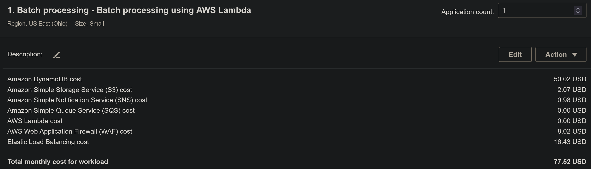
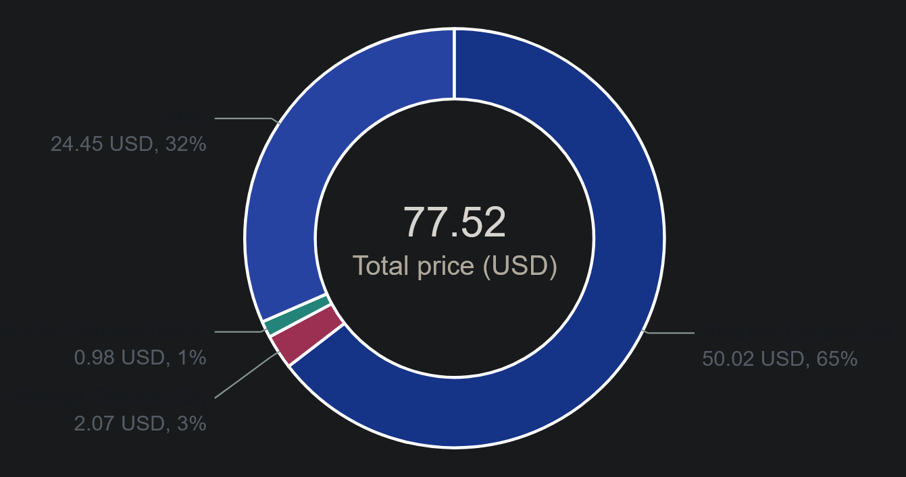
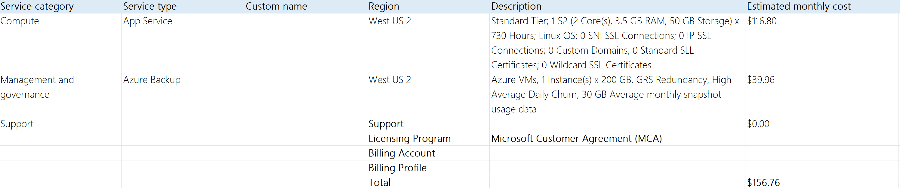
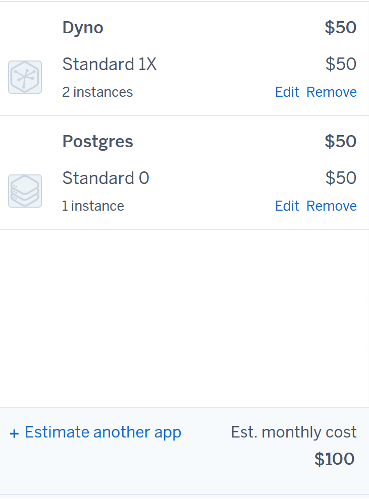
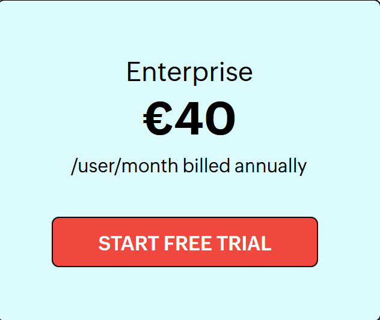
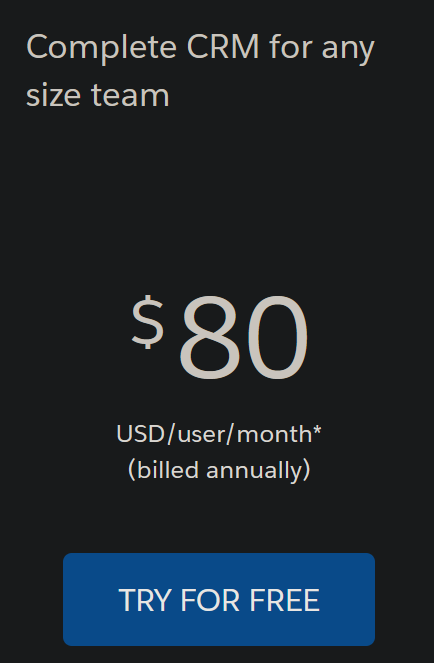
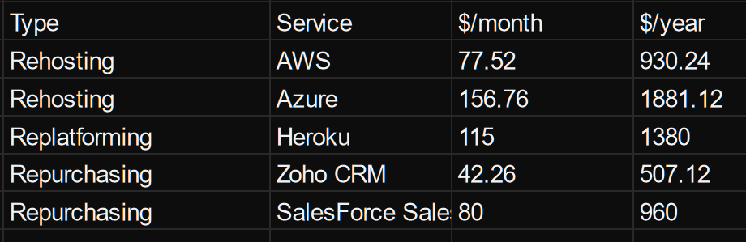

# A

## 1) Rehosting

### AWS

I have went with the proposed settings and added the "Elastic Load Balancer". The only other difference to the standart settings is that I changed the storage from 300gb to 200gb. The cost of the selection above is the following:

Here is also a pie-chart of the pricing:

### Azure

Here just like in the case of AWS I have mostly chosen the preset options except the database backup. 

## 2) Replatforming

for Heroku I went with 2 instances of Dyno for higher sustainability and Postgres. Here is the picture:

## 3) Repurchasing

For Zoho I have chosen the Enterprice option, because it has all feature that our company would need. Here is the picture:

In case of SalesForce I decided to go with the Professional bundle, because I have deemed the more expencive once not nessesary. Here is the picture:

## Comparison Cloud 

At the end of my research I have ended up with the following data:

There were basically 3 price catigories:
* cost < 600 (Zoho CRM)
* 600 < cost < 1000 (AWS, SalesForce)
* 1000 < cost (Azure, Heruko)

The most expencive one of them is the Microfost service "Azure". It is a solid option, but like all microsoft products I think this one is also overpriced. 
In my opinion are all just as good as the others, so I would go for the cheapest one which is Zoho CRM.

